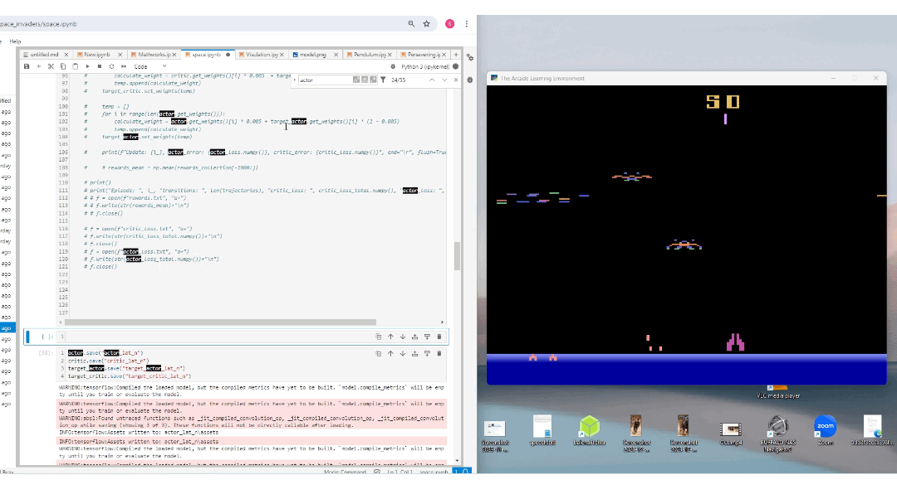
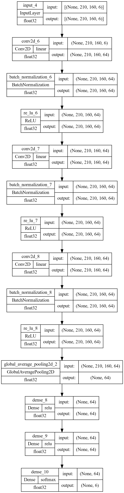
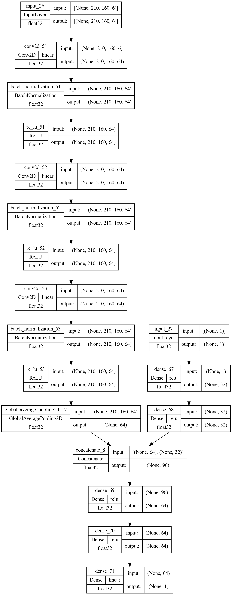

# RL-agent-space-invader
RL agent trained to play the Atari game, The space invader

## Demo
Demo of the RL-agent playing the space invader. 

  

## GYM
The atari games are provided inside the openAI's gym. This repo contains code for the Space Invader, Pendulum and pong.  

## Model architecture
Actor
 

  

Critic
 

  

Other model
 

  

